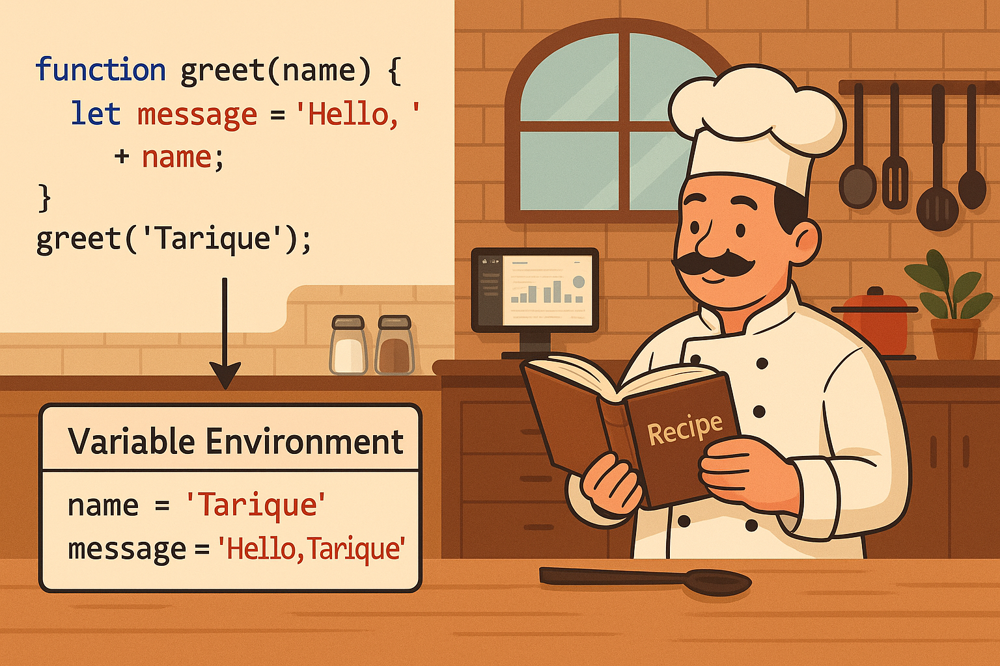

# How Functions Work in JS and Variable Environment

## 📌 Functions in JavaScript

A **function** in JavaScript is a reusable block of code designed to perform a specific task.  
When a function is called, JavaScript creates something called an **Execution Context**, which includes:

- A **Variable Environment** (where variables and parameters are stored).
- A **Scope Chain** (for resolving variables).
- A **this** binding (context of invocation).

---

## 🧠 Jargons to Know First

| Term                 | Simple Explanation                                                             |
|----------------------|---------------------------------------------------------------------------------|
| **Execution Context**| Environment where JavaScript code is evaluated and executed.                   |
| **Variable Environment** | A space where variables, functions, and arguments live during function execution. |
| **Lexical Environment**  | The environment where the function was defined (not called).                |
| **Call Stack**       | A stack that keeps track of function calls.                                    |
| **Scope**            | The current context of execution, which determines the accessibility of variables.|

---

## 🔁 How Functions Work in JS

Let’s take an example:

```js
function greet(name) {
  var message = "Hello, " + name;
  console.log(message);
}
greet("Tarique");
```

---

### ✅ Step 1: Function Declaration

At this stage, JavaScript does **not run the function**.  
Instead, during the **Memory Creation Phase** (also called "Hoisting"), it allocates memory for:

- `name` → `undefined`
- `message` → `undefined`

The function is just stored in memory, ready to be called.

---

### ✅ Step 2: Function Call

When you call:

```js
greet("Tarique");
```

JavaScript does the following:

- Creates a **new Execution Context** for the `greet` function.
- Initializes the **Variable Environment**:

```js
name = "Tarique"
message = "Hello, Tarique"
```

- Places this new context on top of the **Call Stack**.

---

### ✅ Step 3: Variable Environment

The **Variable Environment** is like a temporary workspace — it includes:

- **Function parameters**
- **Local variables declared with var, let, or const**
- **Function declarations (if any)**

Here, it stores:

```js
name = "Tarique"
message = "Hello, Tarique"
```

Once the function finishes execution, this environment is destroyed.

---

### ✅ Step 4: Execution

JavaScript runs this line:

```js
console.log(message); // Hello, Tarique
```

After execution:

- The function context is **removed from the Call Stack**
- Memory for `name` and `message` is cleaned up (garbage collected)

---

## 🧑‍🍳 Real-Life Analogy: The Chef & Kitchen

Think of a **function** like a recipe, and calling a function is like a **chef entering the kitchen** to cook that recipe.

| Analogy Term | JavaScript Term          |
|--------------|---------------------------|
| Recipe       | Function Definition        |
| Chef's workspace | Execution Context     |
| Ingredients on table | Variable Environment |
| Leaving the kitchen | Function execution ends |

---

## 🖼️ Visual Explanation



This diagram explains:

- Function code and invocation
- Creation of the Variable Environment
- A chef (function) following the recipe (code) using available ingredients (variables)

---

## ✅ Final Summary

- Every time a function runs, JS creates a new **Execution Context**.
- It sets up a **Variable Environment** with function parameters and variables.
- Once done, the context is removed from the **Call Stack**.
- Functions remember their parent scope via **Lexical Environment**.

---

This concept forms the foundation for advanced topics like **Closures**, **Scope Chains**, and **Async Callbacks**.
