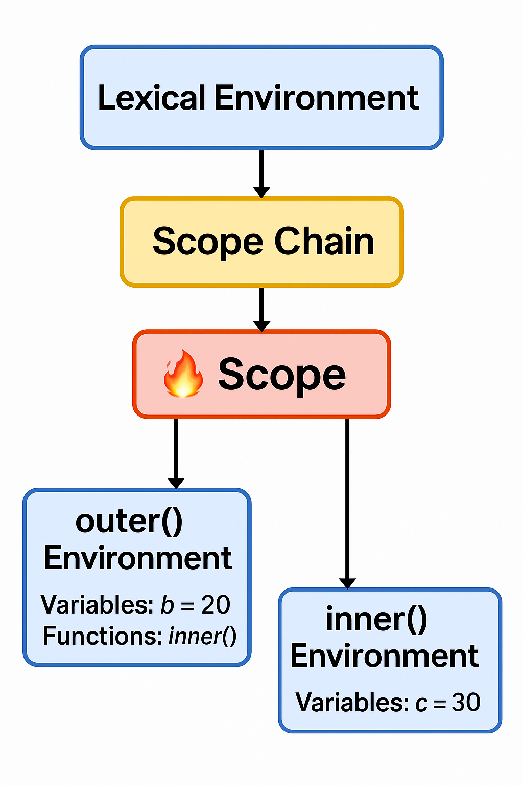

# 🔍 JavaScript Scope Chain, Lexical Environment, and Scope – Explained with Diagram

## 📘 Technical Definitions

### 🔹 Scope

> Scope defines the accessibility of variables and functions in various parts of your code.

JavaScript uses **lexical scope**, meaning scope is defined at **code-writing time**, not runtime.

---

### 🔹 Lexical Environment

> A structure that holds identifier-variable mappings and has a reference to its outer lexical environment.

Each execution context in JS has a lexical environment.

---

### 🔹 Scope Chain

> A mechanism by which JavaScript resolves variable names by looking through chained lexical environments.

---

## 💡 Real-Life Code Scenarios

### ✅ 1. Nested Functions Access Outer Variables

```js
function outer() {
  let name = "Tarique";

  function inner() {
    console.log(name); // ✅ Accesses variable from outer scope
  }

  inner();
}
outer();
```

---

### ✅ 2. Variable Not Accessible from Outside

```js
function outer() {
  let secret = "hidden";
}

console.log(secret); // ❌ ReferenceError
```

---

### ✅ 3. Block Scope with let/const

```js
{
  let x = 100;
}
console.log(x); // ❌ ReferenceError
```

---

### ✅ 4. Scope Chain Traversal to Global

```js
var a = 1;

function f1() {
  function f2() {
    console.log(a); // ✅ Found in global scope
  }
  f2();
}
f1();
```

---

### ✅ 5. Shadowing

```js
let a = 10;

function demo() {
  let a = 20;
  console.log(a); // 20
}
demo();
```

---

## ⚙️ Behind the Scenes: JavaScript Engine

### Execution Steps

1. Create Global Execution Context:

   - Memory Phase:  
     `a → undefined`, `foo → function`

2. Execution Phase:

   - `a = 10`
   - `foo()` is invoked → new Execution Context is created

3. Lexical Environment Created for Each Function:
   - Contains local variables and reference to parent (outer) environment

---

## 🔁 Scope Chain Walk Example

```js
function a() {
  var x = 10;

  function b() {
    var y = 20;

    function c() {
      var z = 30;
      console.log(x, y, z); // ✅ Accesses all due to scope chain
    }

    c();
  }

  b();
}
a();
```

---

## 🧠 Diagram: Lexical Environment & Scope Chain

```txt
┌──────────────────────────────┐
│      Global Environment      │
│ ┌──────────────────────────┐ │
│ │  Variables: a = 10       │ │
│ │  Functions: outer()      │ │
│ └──────────────────────────┘ │
└──────────────┬───────────────┘
               │
               ▼
     ┌──────────────────────┐
     │  outer() Environment │
     │ ┌──────────────────┐ │
     │ │ Variables: b = 20 │ │
     │ │ Functions: inner()│ │
     │ └──────────────────┘ │
     └────────────┬─────────┘
                  │
                  ▼
        ┌────────────────────┐
        │  inner() Env       │
        │ ┌────────────────┐ │
        │ │ Variables: c=30│ │
        │ └────────────────┘ │
        └────────────────────┘
```

---



---
