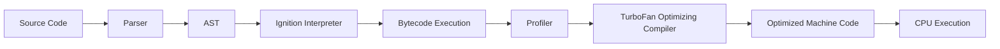

# JavaScript Engine Deep Dive

---

## 1. JavaScript Runtime Environment

The JS runtime is the environment where code executes. It combines the **engine** (V8, SpiderMonkey, etc.), **APIs** from the host (browser or Node.js), the **call stack**, and the **event loop**.

### Diagram: Runtime Environment


---

## 2. Browser vs Node.js Runtime

- **Browser Runtime:** DOM, BOM, Web APIs (fetch, setTimeout, localStorage).
- **Node.js Runtime:** File system, OS modules, process, events, streams.

### Example:

```js
// Browser runtime example
document.querySelector("#btn").addEventListener("click", () => {
  alert("Clicked!");
});

// Node.js runtime example
const fs = require("fs");
fs.readFile("data.txt", "utf-8", (err, data) => {
  if (err) throw err;
  console.log(data);
});
```

---

## 3. Popular JS Engines

- **V8** – Google Chrome, Node.js
- **SpiderMonkey** – Firefox
- **JavaScriptCore (JSC)** – Safari
- **Chakra** – (Legacy) Edge
- **Hermes** – React Native

---

## 4. First Engine Ever Created

- **SpiderMonkey** (by Brendan Eich, Netscape).
- Written in C.

---

## 5. Myths About JS Engines

- **Myth:** JS is only interpreted.
- **Reality:** Modern engines use **hybrid (interpretation + JIT compilation)**.
- **Myth:** V8 compiles to machine code directly without interpretation.
- **Reality:** V8 uses **Ignition interpreter** first, then **TurboFan optimizer**.

---

## 6. JS Engine Architecture

### Diagram: General Flow


---

## 7. Syntax Parser & Abstract Syntax Tree (AST)

- **Parser:** breaks code → tokens → AST.
- **AST:** hierarchical representation of source.

### Example:

Code:

```js
let x = 5 + 10;
```

AST (simplified):

```
Program
 └── VariableDeclaration
      └── VariableDeclarator
           ├── Identifier (x)
           └── BinaryExpression (+)
                ├── Literal (5)
                └── Literal (10)
```

---

## 8. Compilation & Execution

1. Parse → AST
2. Convert to Bytecode
3. Interpreter executes bytecode
4. Hot code → JIT compiler optimizes to machine code

---

## 9. Just-in-Time (JIT) Compilation

- Runs during execution, not ahead of time.
- Optimizes “hot” functions (frequently executed).
- **Deoptimization:** if assumptions fail, engine reverts to slower code.

### Example: Inline Caching

```js
function greet(user) {
  return "Hello " + user.name;
}

greet({ name: "Alice" }); // Optimized after repeated calls
greet({ name: "Bob" });
```

- After repeated calls, engine assumes `user.name` access pattern is stable → optimized.

---

## 10. Is JS Interpreted or Compiled?

- JS is **both**.
- Starts with interpretation (bytecode).
- Optimized by compilation (JIT).

---

## 11. Garbage Collector – Mark & Sweep

- **Mark:** Traverse object graph, mark reachable.
- **Sweep:** Delete unmarked.

### Diagram: GC


### Example:

```js
function demo() {
  let obj = { name: "Tarique" };
  obj = null; // now unreachable, GC will reclaim
}
```

---

## 12. Fastest JS Engine

- **V8** is currently among the fastest due to Ignition + TurboFan + Orinoco GC.
- Competes with SpiderMonkey and JavaScriptCore.

---

## 13. V8 Engine Architecture

### Diagram: V8 Internals



---

# 💡 Real Scenarios

### 1. Performance Bottleneck in Web App

```js
function sum(arr) {
  let total = 0;
  for (let i = 0; i < arr.length; i++) {
    total += arr[i];
  }
  return total;
}

// Called thousands of times → V8 will JIT optimize
```

**Discussion:** Interpreter runs first, profiler collects data, JIT compiles optimized version.

---

### 2. Memory Leak in Node.js

```js
let users = [];
function addUser(user) {
  users.push(user);
}
setInterval(() => addUser({ name: "test" }), 1000);
```

- Leak: `users` keeps growing, objects never freed.
- GC can’t collect because references are still alive.

---

### 3. Cold Start in Serverless

- Heavy libraries increase parse + compile time.
- Optimize: lazy loading, smaller bundles.

---

# 📝 Interview Questions

1. Explain the difference between interpreter and compiler in a JS engine.
2. What role does the AST play?
3. What is inline caching in JIT compilers?
4. Is JavaScript compiled, interpreted, or both? Why?
5. How does the mark & sweep GC algorithm work?
6. Why can optimized code be deoptimized?
7. Compare Node.js runtime vs browser runtime.
8. Which is the fastest JS engine today and why?
9. What is hidden class optimization in V8?
10. Give an example of a memory leak in JS.

---

# 📚 References

- [V8 Official Blog](https://v8.dev)
- [SpiderMonkey Internals](https://developer.mozilla.org/en-US/docs/Mozilla/Projects/SpiderMonkey)
- [ECMAScript Spec](https://tc39.es/ecma262/)
- [Understanding Garbage Collection](https://developer.mozilla.org/en-US/docs/Web/JavaScript/Memory_Management)

---
