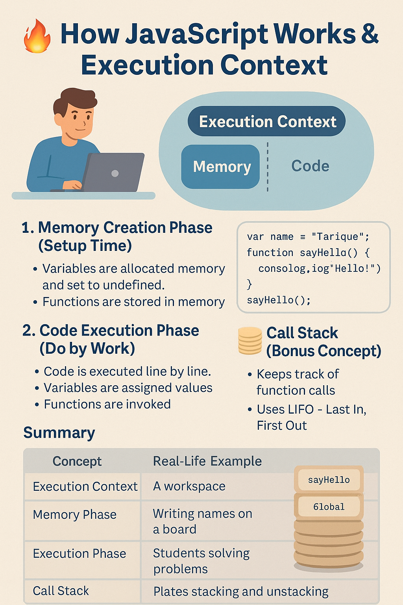

## 📚 Table of Contents

- [How JavaScript Works](#-how-javascript-works)

---

## 🪄 How JavaScript Works

When JavaScript runs, it works like a **smart assistant** that follows every instruction in order.  
To do this, it creates something called an **Execution Context** — a kind of **workspace** or **brain** where it keeps track of what’s happening.

---

### 🧰 What Is an Execution Context?

The **Execution Context** is the environment where JavaScript code is executed.  
It goes through **two main phases** every time a script runs:

1. 🔧 **Memory Creation Phase** (also called _Creation Phase_ or _Variable Environment_)
2. 🚀 **Code Execution Phase** (also called _Thread of Execution_)

---

### ✅ Step 1: Memory Creation Phase (Setup Time)

📦 JavaScript scans the entire code and:

- Creates space in memory for **variables** and **functions**
- Stores everything in **key: value pairs**
- Sets all **variables to `undefined`** (for now)
- Stores **function code as-is** in memory

🧠 **Real-life Analogy**:

> A teacher enters the classroom early and writes the names of all students on the board — but doesn’t give them any tasks yet.  
> It’s like labeling empty boxes on a shelf before putting anything inside.

---

### ✅ Step 2: Code Execution Phase (Do the Work)

📜 Now JavaScript starts executing code **line by line**:

- It replaces `undefined` with **actual values**
- It **executes functions** when they are called

🧠 **Real-life Analogy**:

> The teacher starts calling students one by one to the board to **solve math problems**.  
> Earlier, she just wrote their names — now they’re doing the actual work.

---

### 🧵 Important Notes

- 🧠 **JavaScript is a Synchronous, Single-Threaded Language**
  - **Single Threaded**: JavaScript executes **one command at a time**
  - **Synchronous**: It executes code in a **specific order**, step by step, without skipping anything

---

### 🔄 Call Stack (Bonus Concept)

When functions are called, JavaScript uses a stack called the **Call Stack** to manage what’s currently being executed.

🧠 **Real-life Analogy**:

> Imagine stacking plates in a canteen.  
> You always remove the **last plate added first** — this is called **LIFO (Last In, First Out)**.

JavaScript handles functions the same way:

- The most recently called function goes on **top** of the stack.
- When it finishes, it is **removed** from the top.

---

### 📌 Key Points to Remember

- JavaScript **creates memory first**, then **executes** code line by line.
- All code runs inside an **Execution Context**.
- Every time a function is called, a **new Execution Context** is created.
- The **Call Stack** keeps track of these contexts like a stack of plates.
- Last function in = first to complete and get removed.

### 🧠 Other Names for Call Stack:

Sometimes, people refer to the call stack using different names:

1. Call Stack
2. Execution Context
3. Program Stack
4. Control Stack
5. Machine Stack
6. Runtime Stack

---

## 📷 Visual Poster

