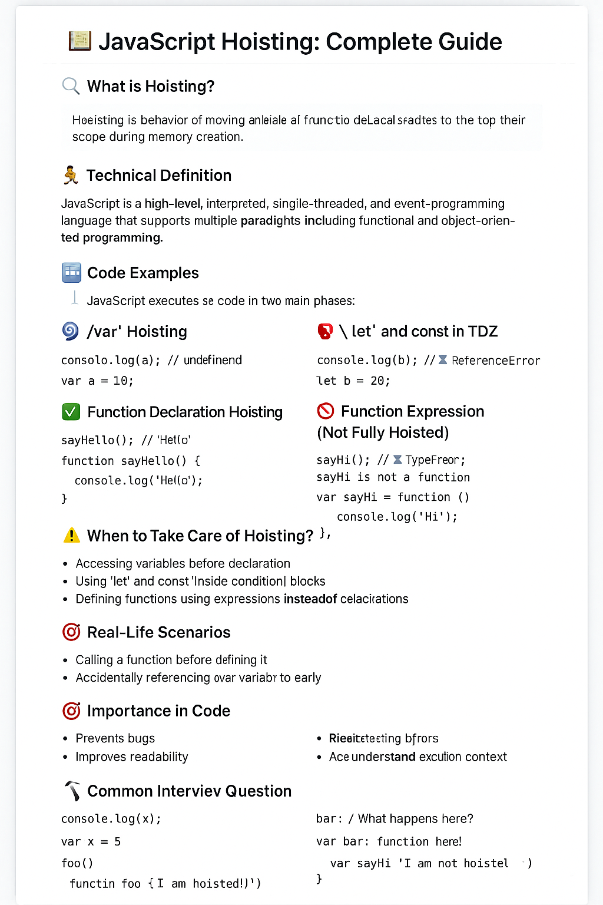

# 📚 JavaScript Hoisting: Complete Guide

Welcome to the ultimate guide on **Hoisting in JavaScript** – a fundamental concept every JavaScript developer must understand to avoid bugs and write predictable code.

---

## 🔍 What is Hoisting?

> **Hoisting** is JavaScript's behavior of moving variable and function declarations to the top of their scope during the memory creation phase.

---

## 🧠 Technical Definition

JavaScript is a high-level, interpreted, **single-threaded**, and **event-driven** programming language that supports multiple paradigms including **functional** and **object-oriented** programming. Hoisting is part of how JavaScript’s **execution context** works.

---

## 🧩 How Hoisting Works

🌀 The JavaScript engine runs code in two main phases:

### 1️⃣ Memory Creation Phase

- `var` variables are **hoisted** and initialized with `undefined`.
- `let` and `const` are **hoisted** but remain in the **Temporal Dead Zone (TDZ)**.
- Function **declarations** are fully hoisted.

### 2️⃣ Code Execution Phase

- JavaScript executes the code **line by line**, using the **hoisted** declarations.

---

## 📝 Code Examples

### ✅ `var` Hoisting

```js
console.log(a); // undefined
var a = 10;
```

### ⛔ `let` and `const` in TDZ

```js
console.log(b); // ❌ ReferenceError
let b = 20;
```

### ✅ Function Declaration Hoisting

```js
sayHello(); // "Hello"

function sayHello() {
  console.log("Hello");
}
```

### ⛔ Function Expression (Not Fully Hoisted)

```js
sayHi(); // ❌ TypeError: sayHi is not a function

var sayHi = function () {
  console.log("Hi");
};
```

---

## ⚠️ When to Take Care of Hoisting?

- Accessing variables **before declaration**.
- Using `let` and `const` inside **conditional blocks**.
- Defining functions using **expressions** instead of declarations.
- Avoiding unexpected `undefined` values.

---

## 🌍 Real-Life Scenarios

- Calling a function **before** defining it.
- Accidentally referencing a `var` variable **too early**.
- TDZ errors with `let`/`const` in **loops** or **conditionals**.

---

## 🎯 Importance in Code

- ✅ Prevents bugs
- ✅ Improves readability
- ✅ Avoids `ReferenceError`s
- ✅ Helps understand **execution context**

---

## ❓ Common Interview Questions

- What is hoisting in JavaScript?
- Are `let` and `const` hoisted?
- What is the difference between **function declaration** and **function expression** in hoisting?
- What is TDZ (Temporal Dead Zone)?
- What happens when you access a `var` variable before its declaration?

---

## 🛠️ Want to Practice?

Try to guess the output:

```js
console.log(x);
var x = 5;

foo();
function foo() {
  console.log("I am hoisted!");
}

bar(); // What happens here?
var bar = function () {
  console.log("I am not hoisted fully!");
};
```

---

## 🔗 Additional Resources

- [MDN Web Docs: Hoisting](https://developer.mozilla.org/en-US/docs/Glossary/Hoisting)
- [JavaScript.info: Hoisting](https://javascript.info/hoisting)
- [You Don't Know JS (book series)](https://github.com/getify/You-Dont-Know-JS)

---

> ✨ **Tip:** Understanding hoisting helps you debug better, write cleaner code, and ace JavaScript interviews!


