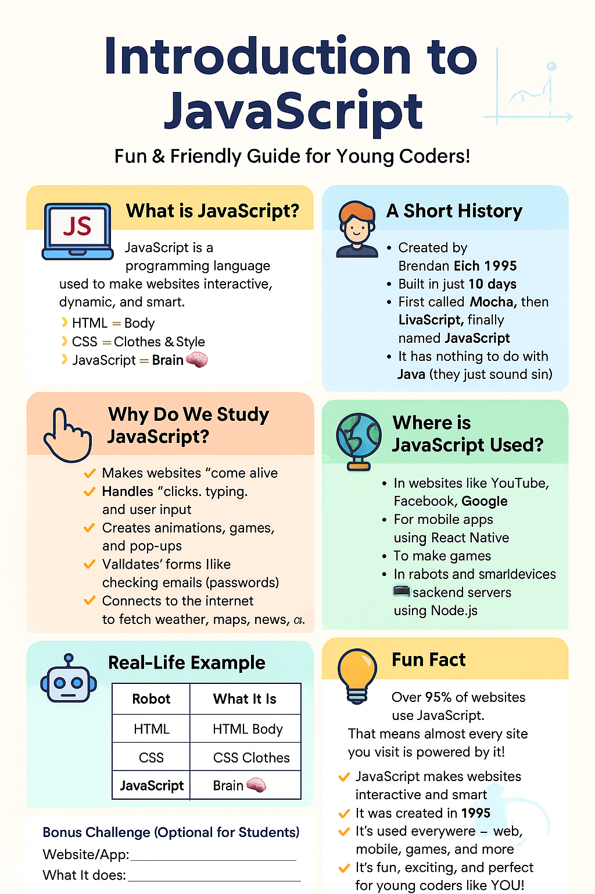

# 💻 Namaste JavaScript

This repository contains my **learning journey** through the _Namaste JavaScript_ course by **Akshay Saini** on YouTube.  
It includes all the key concepts covered in the course, along with **practical code examples**, **exercises**, and **detailed notes** to help reinforce learning.

---

## 📚 Table of Contents

- [Introduction to Namaste JavaScript](#-introduction-to-namaste-javascript)
- [Detailed Notes](#-detailed-notes)
- [Fun Facts](#-fun-fact)
- [Summary](#-summary)

---

## 📖 Introduction to Namaste JavaScript

JavaScript is one of the most popular and powerful programming languages used to build **interactive** and **dynamic** websites.

---

## 📝 Detailed Notes

### 🚀 What is JavaScript?

JavaScript is a **programming language** used to make websites **interactive**, **dynamic**, and **smart**.

If a webpage was a human:

- 🧍 **HTML** = Body  
- 👗 **CSS** = Clothes & Style  
- 🧠 **JavaScript** = Brain  

---

### 📜 A Short History

- 👨‍💻 Created by **Brendan Eich** in **1995**
- ⏱️ Built in just **10 days**
- 🔁 First called **Mocha**, then **LiveScript**, finally named **JavaScript**
- 🚫 It has **nothing to do with Java** (they just sound similar!)

---

### 🎯 Why Do We Study JavaScript?

- 🟢 Makes websites **come alive**
- 🟢 Handles **clicks, typing, and user input**
- 🟢 Creates **animations**, **games**, and **pop-ups**
- 🟢 Validates **forms** (e.g., emails, passwords)
- 🟢 Connects to the internet to fetch **weather, maps, news**, etc.

---

### 🌍 Where is JavaScript Used?

- 🌐 Websites like **YouTube**, **Facebook**, **Google**
- 📱 Mobile apps using **React Native**
- 🎮 Browser-based and mobile **games**
- 🤖 In **robots** and smart devices
- 🖥️ For **backend servers** using **Node.js**

---

## 💥 Fun Fact

> 🔸 Over **95% of websites** use JavaScript!  
> That means almost every site you visit is powered by JavaScript.

---

## 🎓 Summary

- ✅ JavaScript makes websites **interactive** and **smart**
- ✅ It was created in **1995**
- ✅ It's used **everywhere** — web, mobile, games, backend, and more
- ✅ It’s **fun, exciting**, and perfect for **young coders like YOU!**

---

## 📷 Visual Poster

